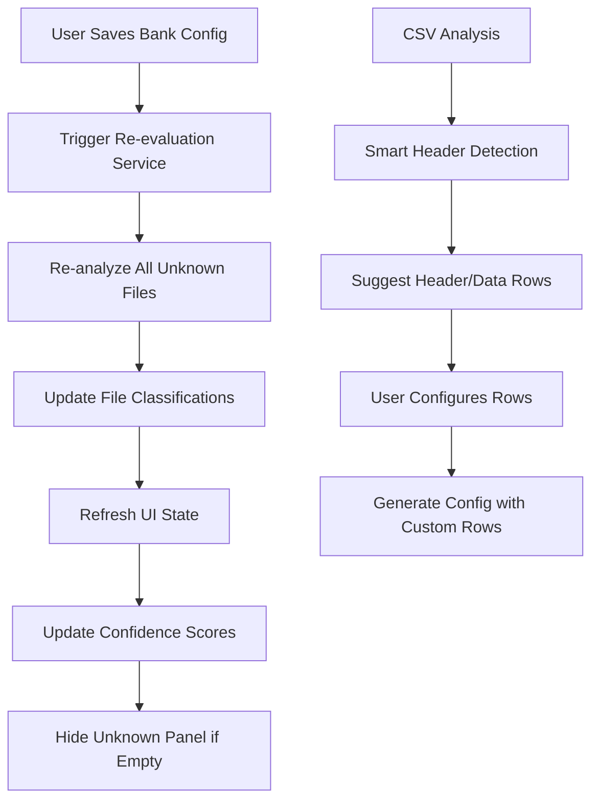
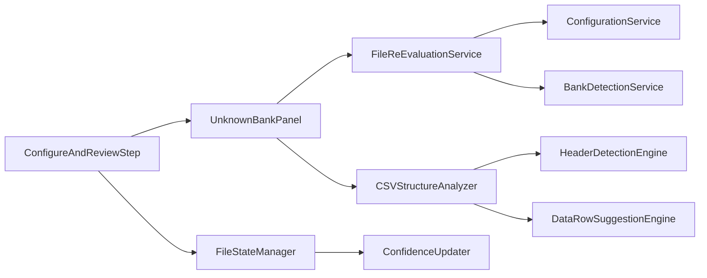

# Design Document

## Overview

This design addresses critical workflow issues in the unknown bank configuration system by implementing automatic file re-evaluation, proper UI state management, and flexible CSV parsing capabilities. The solution enhances user experience by eliminating manual restarts, providing real-time feedback, and supporting complex CSV structures like NayaPay's format.

## Architecture

### High-Level Flow



### Component Architecture



## Components and Interfaces

### 1. FileReEvaluationService

**Purpose:** Manages automatic re-evaluation of unknown files after configuration creation.

**Interface:**
```typescript
interface FileReEvaluationService {
  reEvaluateUnknownFiles(newConfigName: string): Promise<ReEvaluationResult>
  updateFileClassifications(results: FileAnalysisResult[]): Promise<void>
  notifyUIStateChange(changes: FileStateChange[]): void
}

interface ReEvaluationResult {
  processedFiles: number
  reclassifiedFiles: FileReclassification[]
  errors: ReEvaluationError[]
  summary: string
}

interface FileReclassification {
  fileId: string
  fileName: string
  oldStatus: 'unknown'
  newStatus: 'known'
  newBankName: string
  newConfidence: number
}
```

**Key Methods:**
- `reEvaluateUnknownFiles()`: Triggers re-analysis of all unknown files
- `updateFileClassifications()`: Updates file status and confidence scores
- `notifyUIStateChange()`: Sends updates to UI components

### 2. Enhanced UnknownBankPanel

**Purpose:** Extended panel with flexible CSV parsing and re-evaluation integration.

**New Props:**
```typescript
interface UnknownBankPanelProps {
  unknownFiles: UnknownFile[]
  onConfigCreated: (config: BankConfig) => Promise<void>
  onFilesReclassified: (reclassifications: FileReclassification[]) => void
  loading: boolean
  reEvaluationInProgress?: boolean
}
```

**New State:**
```typescript
interface UnknownBankPanelState {
  // Existing state...
  headerRow: number                    // 1-based indexing for user display
  suggestedRows: RowSuggestion[]
  reEvaluationStatus: ReEvaluationStatus
  showReEvaluationProgress: boolean
}

interface RowSuggestion {
  headerRow: number                    // 1-based indexing for user display
  confidence: number
  reasoning: string
}
```

### 3. CSVStructureAnalyzer (Enhanced)

**Purpose:** Intelligent detection of header and data start rows for complex CSV structures.

**Interface:**
```typescript
interface CSVStructureAnalyzer {
  analyzeStructure(csvContent: string): Promise<StructureAnalysis>
  suggestHeaderRows(csvContent: string): Promise<RowSuggestion[]>
  validateRowConfiguration(headerRow: number, csvContent: string): Promise<ValidationResult>
}

interface StructureAnalysis {
  suggestedHeaderRow: number           // 1-based indexing for user display
  alternatives: RowSuggestion[]
  metadata: {
    totalRows: number
    emptyRows: number[]                // 1-based indexing
    potentialHeaderRows: number[]      // 1-based indexing
    dataPatternRows: number[]          // 1-based indexing
  }
}
```

**Key Features:**
- Scans first 20 rows for potential headers
- Identifies metadata sections (account info, summaries)
- Detects transaction data patterns
- Provides confidence scores for suggestions

### 4. FileStateManager

**Purpose:** Centralized management of file states and UI synchronization.

**Interface:**
```typescript
interface FileStateManager {
  updateFileStatus(fileId: string, newStatus: FileStatus): void
  updateFileConfidence(fileId: string, confidence: number): void
  removeUnknownFiles(fileIds: string[]): void
  shouldShowUnknownPanel(): boolean
  getFilesByStatus(status: FileStatus): File[]
}

interface FileStatus {
  type: 'unknown' | 'known' | 'processing'
  bankName?: string
  confidence?: number
  lastUpdated: Date
}
```

### 5. ReEvaluationProgressIndicator

**Purpose:** Visual feedback component for re-evaluation process.

**Interface:**
```typescript
interface ReEvaluationProgressProps {
  isVisible: boolean
  currentFile: string
  processedCount: number
  totalCount: number
  reclassifiedFiles: FileReclassification[]
  onComplete: () => void
}
```

## Data Models

### Enhanced Bank Configuration

```typescript
interface EnhancedBankConfig {
  // Existing fields...
  csv_config: {
    encoding: string
    delimiter: string
    header_row: number        // New: configurable header row (1-based indexing)
    has_header: boolean
    skip_rows: number
  }
  // Other sections...
}
```

### File Re-evaluation Models

```typescript
interface ReEvaluationRequest {
  newConfigName: string
  unknownFileIds: string[]
  triggerSource: 'config_creation' | 'manual_trigger'
}

interface ReEvaluationProgress {
  status: 'starting' | 'processing' | 'completed' | 'error'
  currentFile?: string
  processedCount: number
  totalCount: number
}
```

## Error Handling

### Re-evaluation Error Handling

```typescript
interface ReEvaluationError {
  fileId: string
  fileName: string
  errorType: 'parsing_failed' | 'config_mismatch' | 'network_error'
  message: string
  recoverable: boolean
}
```

**Error Recovery Strategies:**
1. **Parsing Failures**: Log error, continue with other files
2. **Network Errors**: Retry with exponential backoff
3. **Config Mismatches**: Provide detailed feedback to user
4. **Partial Failures**: Complete successful files, report failures

### CSV Structure Analysis Error Handling

```typescript
interface StructureAnalysisError {
  type: 'invalid_csv' | 'no_data_found' | 'ambiguous_structure'
  message: string
  suggestions: string[]
}
```

## Testing Strategy

### Unit Tests

1. **FileReEvaluationService Tests**
   - Test re-evaluation with various file combinations
   - Test error handling for failed re-evaluations
   - Test UI notification mechanisms

2. **CSVStructureAnalyzer Tests**
   - Test header detection with various CSV formats
   - Test NayaPay-style CSV with metadata
   - Test edge cases (empty files, single row, etc.)

3. **UnknownBankPanel Tests**
   - Test header/data row configuration
   - Test re-evaluation progress display
   - Test state management during re-evaluation

### Integration Tests

1. **End-to-End Configuration Workflow**
   - Upload multiple unknown files
   - Create configuration for one bank type
   - Verify automatic re-evaluation
   - Confirm UI state updates

2. **Complex CSV Handling**
   - Test NayaPay CSV configuration
   - Test various header row positions
   - Test data start row configurations

### Performance Tests

1. **Re-evaluation Performance**
   - Test with 10+ unknown files
   - Measure re-evaluation completion time
   - Test concurrent re-evaluation requests

2. **CSV Analysis Performance**
   - Test structure analysis with large CSV files
   - Test header detection speed
   - Memory usage during analysis

## Implementation Details

### Backend Changes

1. **Enhanced Unknown Bank Service**
   - Add header_row parameter to analysis (1-based indexing)
   - Implement intelligent row suggestion algorithm
   - Add re-evaluation endpoint

2. **New API Endpoints**
   ```
   POST /api/v1/unknown-bank/re-evaluate-files
   POST /api/v1/unknown-bank/analyze-structure
   GET /api/v1/unknown-bank/re-evaluation-status/{task_id}
   ```

3. **Configuration Service Updates**
   - Support header_row in config files (1-based indexing)
   - Add validation for row configuration parameters

### Frontend Changes

1. **UnknownBankPanel Enhancements**
   - Add header row and data start row inputs
   - Implement structure suggestion display
   - Add re-evaluation progress indicator

2. **State Management Updates**
   - Add file re-evaluation state
   - Implement confidence score updates
   - Add unknown panel visibility logic

3. **Service Layer Updates**
   - Add re-evaluation service methods
   - Enhance configuration service with new parameters
   - Add progress tracking utilities

### Configuration File Format Updates

```ini
[csv_config]
encoding = utf-8
delimiter = ,
header_row = 13          # New: specify header row (1-based indexing for user clarity)
has_header = true
skip_rows = 0
```

## Migration Strategy

### Phase 1: Backend Infrastructure
- Implement enhanced CSV structure analysis
- Add re-evaluation service
- Create new API endpoints
- Update configuration file handling

### Phase 2: Frontend Integration
- Enhance UnknownBankPanel with new features
- Implement re-evaluation progress UI
- Add file state management
- Update configuration workflow

### Phase 3: Testing and Optimization
- Comprehensive testing with various CSV formats
- Performance optimization
- Error handling refinement
- User experience improvements

## Success Metrics

1. **Workflow Efficiency**
   - Reduce configuration time for multiple files of same bank by 80%
   - Eliminate need for application restarts after config creation

2. **CSV Compatibility**
   - Successfully configure NayaPay and similar complex CSV formats
   - Support 95% of CSV structures with flexible row configuration

3. **User Experience**
   - Real-time UI updates during re-evaluation
   - Clear progress feedback for all operations
   - Intuitive header/data row configuration interface